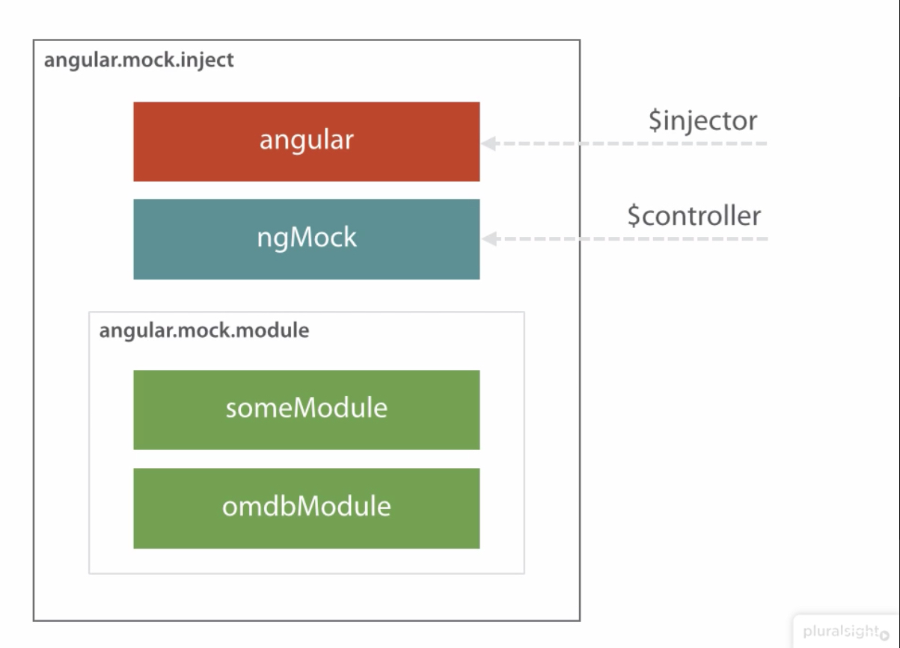

# Unit testing angular.js with Jasmine, Karma and ngMock

## Creating a git repo

````bash
git config --global user.email "raboley@gmail.com"
git config --global user.name "Russell Boley"

echo "# TDDAngularMovieApp" >> README.md
git init
git add README.md
git commit -m "first commit"
git remote add origin https://github.com/raboley/TDDAngularMovieApp.git
git push -u origin master
````

## Setting up Jasmine

Jasmine is a behaviorial driven development tool that can be downloaded from the terminal. It has an html page UI that can be used to check status of tests. First steps are to create a folder then download and unzip it.

````bash
mkdir movie-app
cd movie-app
curl -L -O https://github.com/jasmine/jasmine/releases/download/v2.3.4/jasmine-standalone-2.3.4.zip
unzip jasmine-standalone-2.3.4.zip
````

Once downloaded it will contain 3 folders

* [lib](./src) to house standard librarires
* [spec](./spec) which contains sample tests
* [src](./src) full of sample business logic

[SpectRunner.html](./SpecRunner.html) is the web page UI that displays the unit tests in a browser. There are spaces to put links to test files and logic files in there clearly marked with comments.

## Setting up Karma

Karma allows us to execute our tests via the command line, and is installed with npm via node.js
Before installing it is important to have node.js installed. Once you have node.js use the terminal to install via npm and answer all the prompts. All the defaults should be fine, but a description of the package is nice to have.

````bash
node --version
npm --version
npm init
````

````bash
npm install karma --save-dev
sudo npm install -g karma-cli
# You need to install an add on for every browser that needs to be launched.
npm install karma-jasmine karma-chrome-launcher --save-dev
karma init
````

After typing all those commands it will open up a setup for Karma.  These are the options to choose

jasmine
no
chrome

src/**/*.js
spec/**/*.js

yes

after doing this it creates a karma.conf.js file that has all these settings and can be modified. Then to run the tests just use the command below referencing our config file

````bash
karma start karma.conf.js
````

To allow us to use the command:

````bash
npm test
````

 to test our packs add the karma information to the package.json file.  It should look like this when done:

````json
 "scripts": {
    "test": "./node_modules/karma/bin/karma start karma.conf.js"
  },
````

and then using:

````bash
npm test
````

you should be able to run the tests and get the same results. Make sure to exit the node session and get back to bash terminal.

### Phantom.js launcher

phantom.js launcher can run javascript tests without an actual browser. It is faster than using an actual browser and still accurate so it is good to use. To get install it and other browsers find the phantom.js npm install command on the [Node.js website](www.npmjs.com/package)

````bash
npm install karma-phantomjs-launcher --save-dev
````

Next update the [Karma config file](./movie-app/karma.conf.js) to use Phantom.js instead of chrome.  

````javascript
browsers: ['PhantomJS'],
````

you can also have an array there to use multiple browsers and get all the results outputted. To run both it would look like this:

````javascript
browsers: ['PhantomJS','Chrome'],
````

## Install ngMock and Angular

Newer versions of ngMock you can just npm install, but for this vesrion curl is the only option. Download these files into a new folder called angular.

````bash
cd lib
mkdir angular
cd angular
curl -O https://code.angularjs.org/1.4.4/angular.min.js
curl -O https://code.angularjs.org/1.4.4/angular-mocks.js

# npm install angular-mocks@1.4.4
````

### Post ngMock setup

The install instructions for ngMock can be found on the [angular website](https://docs.angularjs.org/api/ngMock). There are two options now, to use karma or not to use karma.  Use karma is the answer, but below is the info for either option.

For the no Karma option, include the angular-mock.js in the [SpecRunner.html](./movie-app/SpecRunner.html)

````html
<script src="angular.js">
<script src="angular-mocks.js">
````

To use karma update the [Karma config file](./movie-app/karma.conf.js) to include the new files.

````javascript
    // list of files / patterns to load in the browser
    files: [
      'lib/angular/angular.min.js',
      'lib/angular/angular-mocks.js',
      'src/**/*.js',
      'spec/**/*.js'
    ],
````

## Writing a unit test to return json results from omdb api

This first test has the code embedded in the test, and it is just returing the same json we pass in so it is kind of cheating, however the import things to note is that we use the full string json result from the real api. By searching for `'star wars'` on [omdb](http://omdbapi.com/) you get the big result below we will store in the movieData variable.

````javascript
describe('omdb service', function() {
    var movieData = {"Title":"Star Wars: Episode IV - A New Hope","Year":"1977","Rated":"PG","Released":"25 May 1977","Runtime":"121 min","Genre":"Action, Adventure, Fantasy","Director":"George Lucas","Writer":"George Lucas","Actors":"Mark Hamill, Harrison Ford, Carrie Fisher, Peter Cushing","Plot":"Luke Skywalker joins forces with a Jedi Knight, a cocky pilot, a Wookiee and two droids to save the galaxy from the Empire's world-destroying battle-station, while also attempting to rescue Princess Leia from the evil Darth Vader.","Language":"English","Country":"USA","Awards":"Won 6 Oscars. Another 50 wins & 28 nominations.","Poster":"https://m.media-amazon.com/images/M/MV5BNzVlY2MwMjktM2E4OS00Y2Y3LWE3ZjctYzhkZGM3YzA1ZWM2XkEyXkFqcGdeQXVyNzkwMjQ5NzM@._V1_SX300.jpg","Ratings":[{"Source":"Internet Movie Database","Value":"8.6/10"},{"Source":"Rotten Tomatoes","Value":"93%"},{"Source":"Metacritic","Value":"90/100"}],"Metascore":"90","imdbRating":"8.6","imdbVotes":"1,063,160","imdbID":"tt0076759","Type":"movie","DVD":"21 Sep 2004","BoxOffice":"N/A","Production":"20th Century Fox","Website":"http://www.starwars.com/episode-iv/","Response":"True"}

    it('should return search movie data', function() {
        var service = {
            search: function(query) {
                return movieData
            }
        };
        expect(service.search('star wars')).toEqual(movieData);
    });
});
````

First we describe the test, and pass in a function.  Then create the variable to hold what the results should be. _This won't be a great long term test since in a couple years when the new star wars movies come out it will probably cause this test to fail inadvertantly, but oh well._

Next we are creating variable that is a function with a search method that returns the movieData variable. 

The final part is an assertion that we expect the results from our service variable's function will equal the same thing as our json string when we pass it the string `'star wars'`

### mocking modules using ngMock

There are 3 module function argument types

1. string
1. function
1. object

#### String alias

Just reference the module by name.

````javascript
angular.mock.module('omdbModule');
````

#### Anonymous function

Just pass the whole thing in as an anonymous function?

````javascript
angular.mock.module(function($provide)) {
    $provide.factory('omdbApi', function() {
        return {
            search: function(query) {
                return movieData;
            }
        }
    }
});
````

#### Anonymous Object Literal

creates a service using the provide thing, which restricts it to a value service. That means other services cannot be injected.

````javascript
angular.mock.module({
    'omdbApi': {
        search: function(query) {
            return movieData;
        }
    }
});
````

### Adding an object literal mock to our test

Remove the code between the service {} and add an object literal mock below that.

````javascript
        angular.mock.module({
            'omdbApi': {
                search: function(query) {
                    return movieData
                }
            }
        });
````

The automated tests will fail now because we need to load an instance of the module service. This is where the inject mock function comes in.

## ngMock Inject Function

Inject: used to get instances of components from modules. Said another way it creates mocks of components without using ngmodule like how they would be loaded in html. This is shown in the diagram below:



When a module is called, it gets put in a queue to be loaded up, but it isn't till the angular injector is called that it actually gets loaded.

### Object literal style

Using this we can ask for our omdbApi by asking for it by name. The code will look like this when finished.

````javascript
    it('should return search movie data', function() {
        var omdbApi = {};

        angular.mock.module({
            'omdbApi': {
                search: function(query) {
                    return movieData
                }
            }
        });

        angular.mock.inject(function(_omdbApi_) {
            omdbApi = _omdbApi_;
        });

        expect(omdbApi.search('star wars')).toEqual(movieData);
    });
````

`angular.mock.module` passes in a mock of the ES module we created called omdbApi. This api is an object literal. Object literals are basically key value pairs that are very flexible. like dictionary or hash tables that can have any types including functions and other objects as the "value" part of the key value pair. The omdbApi object literal contains another object literal. It has a key of `search` which has a value of an anonymous function that returns `movieData` from a query paramter.  At this point the function isn't very useful since it just returns our movie data variable no matter what the input is, but later it will be better.

We then call angular mock which passes in an anonymous function that calls mock inject with our omdb api and creates an instance of it. It can then be called by our expect clause at the botttom and compared. the underscores resolve a conflict where you can't pass in something of the same name, but get removed at runtime so it will still work.

### Function argument technique

another option is to use the angular factory pattern to spin up an instance of the module. This will return a module with the same search method that returns the same static movie data for now.

````javascript
    it('should return search movie data', function() {
        var omdbApi = {};

        angular.mock.module(function($provide) {
            $provide.factory('omdbApi', function() {
                return {
                    search: function(query) {
                        return movieData;
                    }
                }
            })
        });

        angular.mock.inject(function(_omdbApi_) {
            omdbApi = _omdbApi_;
        });

        expect(omdbApi.search('star wars')).toEqual(movieData);
    });
````

## Importing modules from external files

Now we will seperate the business logic from the test and import it into the test as a module. To start create a src file within the movie-app folder if it doesn't exist, then create another folder called omdb with a file inside it called service.js.

That file will hold the logic to return the query data. We will use the same factory logic as in the previous example, just extract it to an external file. The omdb module will have a factory to create the service omdbApi with the method search. It will still return the same static string from before.

````javascript
angular.module('omdb',[])
    .factory('omdbApi', function() {
        var service = {};

        service.search = function(query) {
            return {"Search":[{"Title":"Star Wars: Episode IV - A New Hope","Year":"1977","Rated":"PG","Released":"25 May 1977","Runtime":"121 min","Genre":"Action, Adventure, Fantasy","Director":"George Lucas","Writer":"George Lucas","Actors":"Mark Hamill, Harrison Ford, Carrie Fisher, Peter Cushing","Plot":"Luke Skywalker joins forces with a Jedi Knight, a cocky pilot, a Wookiee and two droids to save the galaxy from the Empire's world-destroying battle-station, while also attempting to rescue Princess Leia from the evil Darth Vader.","Language":"English","Country":"USA","Awards":"Won 6 Oscars. Another 50 wins & 28 nominations.","Poster":"https://m.media-amazon.com/images/M/MV5BNzVlY2MwMjktM2E4OS00Y2Y3LWE3ZjctYzhkZGM3YzA1ZWM2XkEyXkFqcGdeQXVyNzkwMjQ5NzM@._V1_SX300.jpg","Ratings":[{"Source":"Internet Movie Database","Value":"8.6/10"},{"Source":"Rotten Tomatoes","Value":"93%"},{"Source":"Metacritic","Value":"90/100"}],"Metascore":"90","imdbRating":"8.6","imdbVotes":"1,063,160","imdbID":"tt0076759","Type":"movie","DVD":"21 Sep 2004","BoxOffice":"N/A","Production":"20th Century Fox","Website":"http://www.starwars.com/episode-iv/","Response":"True"}]};
        }

        return service;
    });
````

after that just update the test to reference the omdb module by name and we will still have a passing test.

````javascript
    it('should return search movie data', function() {
        var omdbApi = {};

        angular.mock.module('omdb');

        angular.mock.inject(function(_omdbApi_) {
            omdbApi = _omdbApi_;
        });

        expect(omdbApi.search('star wars')).toEqual(movieData);
    });
````

## add a second test

Now that the search method is working, lets add a find method which will search the api by id. It should be pretty similar to the previous test, so a lot of the code can be re-used, but it will need a new sample data json to test. On the [omdb](http://omdbapi.com/) website put in the id of tt0076759 and paste the results in a new object called movieDataById at the top of the spec file.

````javascript
var movieDataById = {"Title":"Star Wars: Episode IV - A New Hope","Year":"1977","Rated":"PG","Released":"25 May 1977","Runtime":"121 min","Genre":"Action, Adventure, Fantasy","Director":"George Lucas","Writer":"George Lucas","Actors":"Mark Hamill, Harrison Ford, Carrie Fisher, Peter Cushing","Plot":"Luke Skywalker joins forces with a Jedi Knight, a cocky pilot, a Wookiee and two droids to save the galaxy from the Empire's world-destroying battle-station, while also attempting to rescue Princess Leia from the evil Darth Vader.","Language":"English","Country":"USA","Awards":"Won 6 Oscars. Another 50 wins & 28 nominations.","Poster":"https://m.media-amazon.com/images/M/MV5BNzVlY2MwMjktM2E4OS00Y2Y3LWE3ZjctYzhkZGM3YzA1ZWM2XkEyXkFqcGdeQXVyNzkwMjQ5NzM@._V1_SX300.jpg","Ratings":[{"Source":"Internet Movie Database","Value":"8.6/10"},{"Source":"Rotten Tomatoes","Value":"93%"},{"Source":"Metacritic","Value":"90/100"}],"Metascore":"90","imdbRating":"8.6","imdbVotes":"1,063,160","imdbID":"tt0076759","Type":"movie","DVD":"21 Sep 2004","BoxOffice":"N/A","Production":"20th Century Fox","Website":"http://www.starwars.com/episode-iv/","Response":"True"}
````

Next copy the above test to a new test changing the data and service referenced.

````javascript
    it('should return movie data by id', function() {
        var omdbApi = {};

        angular.mock.module('omdb');

        angular.mock.inject(function(_omdbApi_) {
            omdbApi = _omdbApi_;
        });

        expect(omdbApi.find('tt0076759')).toEqual(movieDataById);
    });
````

notice the description of the test, the service call and the variable referenced are the only changes needed.

Next create the new service in the src file. It should also be very similar to the previous one so copy paste is very handy. The full file is below, but the onyl change is the addition of the service.find

````javascript
angular.module('omdb',[])
    .factory('omdbApi', function() {
        var service = {};

        service.search = function(query) {
            return {"Search":[{"Title":"Star Wars: Episode IV - A New Hope","Year":"1977","Rated":"PG","Released":"25 May 1977","Runtime":"121 min","Genre":"Action, Adventure, Fantasy","Director":"George Lucas","Writer":"George Lucas","Actors":"Mark Hamill, Harrison Ford, Carrie Fisher, Peter Cushing","Plot":"Luke Skywalker joins forces with a Jedi Knight, a cocky pilot, a Wookiee and two droids to save the galaxy from the Empire's world-destroying battle-station, while also attempting to rescue Princess Leia from the evil Darth Vader.","Language":"English","Country":"USA","Awards":"Won 6 Oscars. Another 50 wins & 28 nominations.","Poster":"https://m.media-amazon.com/images/M/MV5BNzVlY2MwMjktM2E4OS00Y2Y3LWE3ZjctYzhkZGM3YzA1ZWM2XkEyXkFqcGdeQXVyNzkwMjQ5NzM@._V1_SX300.jpg","Ratings":[{"Source":"Internet Movie Database","Value":"8.6/10"},{"Source":"Rotten Tomatoes","Value":"93%"},{"Source":"Metacritic","Value":"90/100"}],"Metascore":"90","imdbRating":"8.6","imdbVotes":"1,063,160","imdbID":"tt0076759","Type":"movie","DVD":"21 Sep 2004","BoxOffice":"N/A","Production":"20th Century Fox","Website":"http://www.starwars.com/episode-iv/","Response":"True"}]};
        }

        service.find = function(id) {
            return {"Title":"Star Wars: Episode IV - A New Hope","Year":"1977","Rated":"PG","Released":"25 May 1977","Runtime":"121 min","Genre":"Action, Adventure, Fantasy","Director":"George Lucas","Writer":"George Lucas","Actors":"Mark Hamill, Harrison Ford, Carrie Fisher, Peter Cushing","Plot":"Luke Skywalker joins forces with a Jedi Knight, a cocky pilot, a Wookiee and two droids to save the galaxy from the Empire's world-destroying battle-station, while also attempting to rescue Princess Leia from the evil Darth Vader.","Language":"English","Country":"USA","Awards":"Won 6 Oscars. Another 50 wins & 28 nominations.","Poster":"https://m.media-amazon.com/images/M/MV5BNzVlY2MwMjktM2E4OS00Y2Y3LWE3ZjctYzhkZGM3YzA1ZWM2XkEyXkFqcGdeQXVyNzkwMjQ5NzM@._V1_SX300.jpg","Ratings":[{"Source":"Internet Movie Database","Value":"8.6/10"},{"Source":"Rotten Tomatoes","Value":"93%"},{"Source":"Metacritic","Value":"90/100"}],"Metascore":"90","imdbRating":"8.6","imdbVotes":"1,063,160","imdbID":"tt0076759","Type":"movie","DVD":"21 Sep 2004","BoxOffice":"N/A","Production":"20th Century Fox","Website":"http://www.starwars.com/episode-iv/","Response":"True"};
        }


        return service;
    });
````

save that and you should have a passing test.

### refactor the test to use beforeEach

beforeEach function runs the code inside before each test. since a lot of our code is duplicated this change will make it much more readable and less repeated.

above the first it statement add a beforeEach() to mock our omdb module, and then also pull out the construction of the omdbApi variable above that.

````javascript
var omdbApi = {};

beforeEach(angular.mock.module('omdb'));
````

the same thing can then be done with calls to the inject function inside each test. Once that is done it leaves us with a much cleaner looking test where the plumbing happens in the beforeEach calls, and the tests only contain calls to the business logic we want to test. The full file is below.

````javascript
describe('omdb service', function() {
    var movieData = {"Search":[{"Title":"Star Wars: Episode IV - A New Hope","Year":"1977","Rated":"PG","Released":"25 May 1977","Runtime":"121 min","Genre":"Action, Adventure, Fantasy","Director":"George Lucas","Writer":"George Lucas","Actors":"Mark Hamill, Harrison Ford, Carrie Fisher, Peter Cushing","Plot":"Luke Skywalker joins forces with a Jedi Knight, a cocky pilot, a Wookiee and two droids to save the galaxy from the Empire's world-destroying battle-station, while also attempting to rescue Princess Leia from the evil Darth Vader.","Language":"English","Country":"USA","Awards":"Won 6 Oscars. Another 50 wins & 28 nominations.","Poster":"https://m.media-amazon.com/images/M/MV5BNzVlY2MwMjktM2E4OS00Y2Y3LWE3ZjctYzhkZGM3YzA1ZWM2XkEyXkFqcGdeQXVyNzkwMjQ5NzM@._V1_SX300.jpg","Ratings":[{"Source":"Internet Movie Database","Value":"8.6/10"},{"Source":"Rotten Tomatoes","Value":"93%"},{"Source":"Metacritic","Value":"90/100"}],"Metascore":"90","imdbRating":"8.6","imdbVotes":"1,063,160","imdbID":"tt0076759","Type":"movie","DVD":"21 Sep 2004","BoxOffice":"N/A","Production":"20th Century Fox","Website":"http://www.starwars.com/episode-iv/","Response":"True"}]};
    var movieDataById = {"Title":"Star Wars: Episode IV - A New Hope","Year":"1977","Rated":"PG","Released":"25 May 1977","Runtime":"121 min","Genre":"Action, Adventure, Fantasy","Director":"George Lucas","Writer":"George Lucas","Actors":"Mark Hamill, Harrison Ford, Carrie Fisher, Peter Cushing","Plot":"Luke Skywalker joins forces with a Jedi Knight, a cocky pilot, a Wookiee and two droids to save the galaxy from the Empire's world-destroying battle-station, while also attempting to rescue Princess Leia from the evil Darth Vader.","Language":"English","Country":"USA","Awards":"Won 6 Oscars. Another 50 wins & 28 nominations.","Poster":"https://m.media-amazon.com/images/M/MV5BNzVlY2MwMjktM2E4OS00Y2Y3LWE3ZjctYzhkZGM3YzA1ZWM2XkEyXkFqcGdeQXVyNzkwMjQ5NzM@._V1_SX300.jpg","Ratings":[{"Source":"Internet Movie Database","Value":"8.6/10"},{"Source":"Rotten Tomatoes","Value":"93%"},{"Source":"Metacritic","Value":"90/100"}],"Metascore":"90","imdbRating":"8.6","imdbVotes":"1,063,160","imdbID":"tt0076759","Type":"movie","DVD":"21 Sep 2004","BoxOffice":"N/A","Production":"20th Century Fox","Website":"http://www.starwars.com/episode-iv/","Response":"True"}
    var omdbApi = {};

    beforeEach(angular.mock.module('omdb'));

    beforeEach(angular.mock.inject(function(_omdbApi_) {
        omdbApi = _omdbApi_;
    }));

    it('should return search movie data', function() {
        expect(omdbApi.search('star wars')).toEqual(movieData);
    });

    it('should return movie data by id', function() {
        expect(omdbApi.find('tt0076759')).toEqual(movieDataById);
    });
});
````

One thing to note is that the `module` and `inject` methods are both so commonly used that they are available at the window level. This means that the `angular.mock` prefix is optional. Those could be re-written as: 

````javascript
    beforeEach(module('omdb'));

    beforeEach(inject(function(_omdbApi_) {
        omdbApi = _omdbApi_;
    }));
````

and do exactly the same thing. I am going to keep the prefix just so that it is clear where these commands are coming from, but they are not required.

## Debugging with Dump